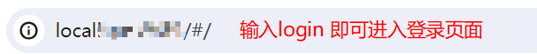
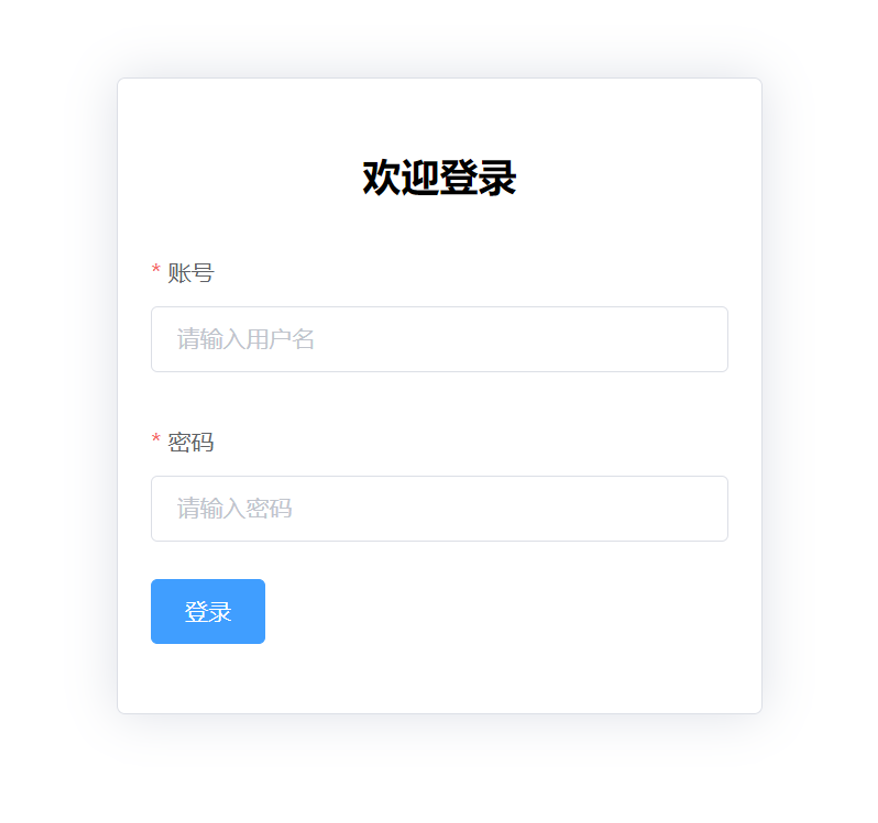
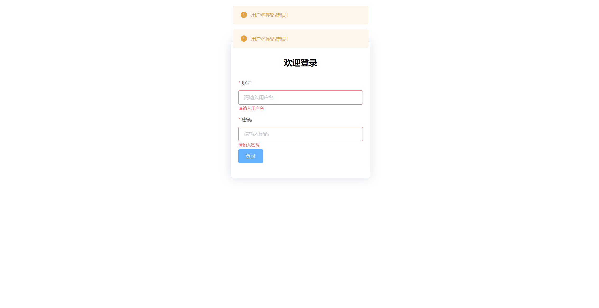

<h1 style="text-align: center;">监控管理页面</h1>


> 本项目采用Vue2 + Vue-router + echarts（组件库使用的是element-ui）
>
>

## 项目首页截图


## 项目详细使用方法请见底部

```
在终端打开该项目路径，然后输入
npm run dev
```

## 登录页面

 

  

**【说明，在登录页面账号和密码随便输入内容，然后点登录即可，该项目没有接入后端，只是单纯的一个前端Vue项目】**



## 使用方法：

1. **打包下载，然后安装node.js ( 地址如下 )** 

**[Node.js 中文网](https://nodejs.cn/)**

2. **安装依赖**

```html
在下载的本项目的目录下右击--在终端中打开
npm install    
```

然后运行即可

> **npm run dev**


